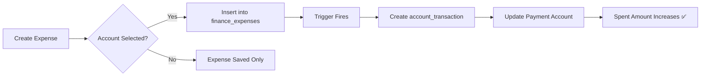

# 📚 Comprehensive Expense Tracking Guide

## 🎯 Overview

Your POS app now has a **complete expense tracking system** that automatically updates payment account balances when you record expenses!

---

## 🚀 Quick Start

### Step 1: Setup (Run Once)
```bash
# Run this SQL script in your database
SETUP-EXPENSE-TRACKING-SYSTEM.sql
```

This installs:
- ✅ 19 pre-configured expense categories
- ✅ Automatic payment account integration
- ✅ Triggers to update "Spent" amounts
- ✅ Reporting views

### Step 2: Navigate to Expenses
1. Open your POS app
2. Go to **Finance** → **Expenses** (or Finance Management)
3. You'll see the expense tracking dashboard

### Step 3: Add Your First Expense
1. Click **"Add Expense"** button
2. Fill in the details (see form guide below)
3. Click **Save**
4. ✅ Payment account "Spent" updates automatically!

---

## 📝 How to Add Expenses

### Expense Form Fields

| Field | Required | Description | Example |
|-------|----------|-------------|---------|
| **Title** | ✅ Yes | Brief description | "Monthly Office Rent" |
| **Category** | ✅ Yes | Select from 19 categories | "Rent" |
| **Amount** | ✅ Yes | Expense amount | 500000 (TSh 500,000) |
| **Payment Account** | ⚠️ Recommended | Which account paid | "Cash", "CRDB Bank" |
| **Description** | Optional | Detailed notes | "October rent payment" |
| **Expense Date** | ✅ Yes | When expense occurred | 10/13/2025 |
| **Payment Method** | Optional | How paid | Cash, Card, Transfer |
| **Status** | Auto | Approval status | Approved, Pending |
| **Receipt Number** | Optional | Receipt reference | "RENT-OCT-2025" |
| **Vendor** | Optional | Who was paid | "Building Owner" |

### Example: Recording Office Rent

```
Title: Monthly Office Rent - October
Category: Rent 🏢
Amount: TSh 500,000
Payment Account: Cash
Description: Rent payment for October 2025
Expense Date: 10/01/2025
Payment Method: Cash
Vendor: ABC Properties Ltd
Receipt Number: RENT-OCT-2025
Status: Approved
```

**Result:**
- ✅ Expense recorded in database
- ✅ Cash account "Spent" increases by TSh 500,000
- ✅ Cash account balance decreases by TSh 500,000
- ✅ Shows in Recent Activity with `-TSh 500,000`

---

## 📊 19 Expense Categories

### 🏢 Office & Facilities
1. **Rent** - Office or shop rent payments
2. **Utilities** 💡 - Electricity, water, internet
3. **Office Supplies** 📝 - Stationery, equipment
4. **Cleaning & Sanitation** 🧹 - Cleaning services

### 👥 People
5. **Salaries** - Employee wages and salaries
6. **Training & Development** 📚 - Employee training

### 🚀 Business Growth
7. **Marketing** 📢 - Advertising, promotions
8. **Software & Subscriptions** 💻 - SaaS, licenses

### 🔧 Operations
9. **Repairs & Maintenance** - Equipment repairs
10. **Transportation** 🚗 - Fuel, vehicle costs
11. **Security** 🔒 - Security services
12. **Inventory Purchase** 📦 - Stock purchases

### 💼 Professional
13. **Professional Services** - Legal, accounting
14. **Insurance** 🛡️ - Business insurance
15. **Taxes & Fees** 📊 - Government taxes

### 💳 Financial
16. **Bank Charges** 🏦 - Bank fees, charges
17. **Telecommunications** 📞 - Phone bills

### 🍽️ Other
18. **Food & Beverages** ☕ - Office refreshments
19. **Miscellaneous** 📋 - Other expenses

---

## ⚙️ How Auto-Integration Works

### When You Create an Expense



### Behind the Scenes

1. **You save an expense** with account_id = Cash account
2. **Database trigger fires** automatically
3. **Creates account_transaction**:
   ```sql
   {
     transaction_type: 'expense',
     amount: 500000,
     description: 'Monthly Office Rent - Rent',
     account_id: cash_account_id
   }
   ```
4. **Payment Accounts page** shows:
   - Spent: TSh 500,000 (increased)
   - Balance: Previous - 500,000 (decreased)

---

## 💡 Best Practices

### 1. Always Select a Payment Account
❌ **Don't:**
```
Title: Office Rent
Amount: 500000
Account: (not selected) ← Won't update payment accounts!
```

✅ **Do:**
```
Title: Office Rent
Amount: 500000
Account: Cash ← Updates Cash account automatically!
```

### 2. Use Descriptive Titles
❌ **Don't:** "Expense 1", "Payment", "Bill"

✅ **Do:** 
- "Monthly Office Rent - October"
- "Electricity Bill - September"
- "Employee Salary - John Doe"

### 3. Add Receipt Numbers
Helps with:
- Audit trails
- Finding expenses later
- Reconciliation

Format: `CATEGORY-MONTH-YEAR`
- RENT-OCT-2025
- UTIL-SEP-2025
- SAL-001-OCT

### 4. Use Correct Categories
Helps with:
- Financial reports
- Budget tracking
- Tax preparation

### 5. Fill in Vendor Information
Especially for:
- Rent (building owner)
- Utilities (TANESCO, etc.)
- Suppliers
- Service providers

---

## 📈 Viewing & Managing Expenses

### Expense List View

```
═════════════════════════════════════════════════════
   EXPENSES
═════════════════════════════════════════════════════

🏢 Monthly Office Rent - October
   Category: Rent
   Amount: TSh 500,000
   Account: Cash
   Date: 10/01/2025
   Status: ✅ Approved

💡 Electricity Bill - September
   Category: Utilities
   Amount: TSh 150,000
   Account: CRDB Bank
   Date: 10/05/2025
   Status: ✅ Approved

📦 Stock Purchase - Smartphones
   Category: Inventory Purchase
   Amount: TSh 2,000,000
   Account: M-Pesa
   Date: 10/10/2025
   Status: ⏳ Pending
```

### Filtering Options

- **By Status:** Approved, Pending, Rejected
- **By Category:** Select specific category
- **By Date Range:** From/To dates
- **By Payment Method:** Cash, Card, Transfer
- **By Account:** Specific payment account

---

## 🎯 Common Use Cases

### Use Case 1: Monthly Recurring Expenses

**Every Month:**
1. Office Rent (1st of month)
2. Electricity Bill (5th of month)
3. Internet Bill (10th of month)
4. Salaries (End of month)

**How to Track:**
```
For each expense:
- Same title format: "Monthly [Expense] - [Month]"
- Same category
- Update amount if different
- Keep receipt numbers sequential
```

### Use Case 2: One-Time Purchases

**Example: Buy Office Furniture**
```
Title: Office Desk and Chairs
Category: Office Supplies
Amount: TSh 450,000
Account: Cash
Vendor: XYZ Furniture
Receipt: FURN-001-OCT-2025
```

### Use Case 3: Petty Cash Expenses

**Small daily expenses:**
```
Title: Office Cleaning Supplies
Category: Cleaning & Sanitation
Amount: TSh 15,000
Account: Cash (Petty Cash)
Description: Detergent, mops, sanitizer
```

### Use Case 4: Supplier Payments

**Paying for inventory:**
```
Title: Stock Purchase - Electronics
Category: Inventory Purchase
Amount: TSh 5,000,000
Account: CRDB Bank
Vendor: Tech Supplies Ltd
Receipt: PO-2025-145
```

---

## 📊 Reports & Analytics

### View 1: Expenses by Category
```sql
SELECT * FROM v_expense_summary_by_category;
```

Shows:
- Total spent per category
- Number of expenses
- Average expense amount
- Date range

### View 2: Monthly Summary
```sql
SELECT * FROM v_monthly_expense_summary;
```

Shows:
- Monthly expense totals
- Number of expenses per month
- Categories used
- Accounts used

### View 3: Expenses with Account Details
```sql
SELECT * FROM v_expenses_with_accounts
WHERE expense_date >= '2025-10-01';
```

Shows complete expense info with account names.

---

## ⚠️ Important Notes

### Status Workflow

1. **Pending** → Expense created but not yet approved
   - ❌ Does NOT update payment accounts
   - Shows in expense list with ⏳ icon

2. **Approved** → Expense approved
   - ✅ Updates payment account "Spent"
   - ✅ Creates account_transaction
   - Shows in expense list with ✅ icon

3. **Rejected** → Expense rejected
   - ❌ Removes account_transaction if exists
   - ❌ Does not affect payment accounts
   - Shows in expense list with ❌ icon

### Auto-Approval

By default, expenses are created as **"Approved"** (status = 'approved').

If you want approval workflow:
1. Set status to 'pending' when creating
2. Manager approves later
3. On approval → account_transaction created

---

## 🔧 Troubleshooting

### Issue 1: "Spent" Not Updating

**Check:**
1. ✅ Did you select a payment account?
2. ✅ Is expense status = 'approved'?
3. ✅ Did you run SETUP-EXPENSE-TRACKING-SYSTEM.sql?
4. ✅ Are triggers enabled?

**Verify:**
```sql
-- Check if triggers exist
SELECT tgname FROM pg_trigger 
WHERE tgrelid = 'finance_expenses'::regclass;
```

### Issue 2: Cannot See Expense Categories

**Solution:**
```sql
-- Reinstall categories
INSERT INTO finance_expense_categories (name, description, icon, color) VALUES
  ('Office Supplies', 'Stationery and equipment', '📝', '#F59E0B')
ON CONFLICT (name) DO NOTHING;
```

### Issue 3: Expense Deleted but Transaction Remains

**Shouldn't happen** - trigger should handle it.

**Manual fix:**
```sql
DELETE FROM account_transactions
WHERE related_entity_type = 'expense'
AND related_entity_id NOT IN (SELECT id FROM finance_expenses);
```

---

## 🎓 Tips for Effective Expense Tracking

### 1. Daily Recording
Record expenses daily, not monthly. Easier to remember details.

### 2. Keep Digital Receipts
Take photos of receipts, store in cloud, add URLs to receipt_url field.

### 3. Consistent Naming
Use consistent naming conventions:
- "Monthly [Type] - [Month]" for recurring
- "[Item/Service] - [Details]" for one-time

### 4. Regular Reviews
Weekly: Review pending expenses
Monthly: Analyze expense reports
Quarterly: Budget vs actual comparison

### 5. Budget Tracking
Set monthly budgets per category, track against actual.

---

## 📱 Mobile Access

If using mobile:
1. Navigate to Finance section
2. Tap "Expenses"
3. Use "+" button to add
4. Fill form and save
5. Swipe to delete/edit

---

## ✅ Checklist for New Expense

Before saving, verify:
- [ ] Title is descriptive
- [ ] Category selected
- [ ] Amount is correct
- [ ] Payment account selected ⭐
- [ ] Date is accurate
- [ ] Vendor added (if applicable)
- [ ] Receipt number added (if available)
- [ ] Description provides context

---

## 🎉 Summary

Your expense tracking system now:
- ✅ Tracks all business expenses
- ✅ Automatically updates payment accounts
- ✅ Shows "Spent" amounts correctly
- ✅ Provides 19 expense categories
- ✅ Supports approval workflows
- ✅ Includes reporting views
- ✅ Maintains audit trails

**You're all set to track expenses professionally!** 🚀

---

## 📞 Quick Reference

### Add Expense
**Finance** → **Expenses** → **Add Expense**

### View Reports
**Finance** → **Expenses** → **Filter/Export**

### Check Payment Account Impact
**Finance** → **Payment Accounts** → **Refresh**

### Categories
19 built-in categories covering all business needs

### Auto-Updates
Payment account "Spent" updates automatically when expense is approved

